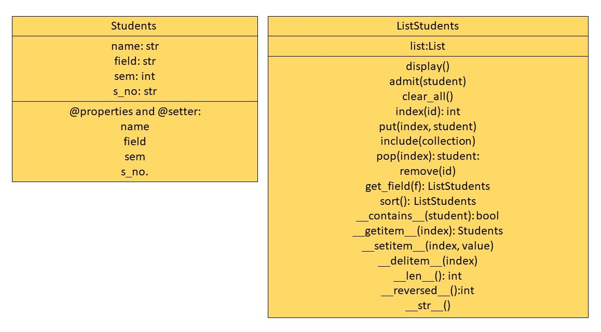

# List Objects
## Lab Task Week 10

**Contains:**

- CreditCard
- ListCC
- Students
- ListStudents


### UML Diagrams
#### CreditCard & ListCC


#### Students and ListStudents


### Repository Structure
```
Lists-Lab-Task-w10
│   .gitignore
│   README.md
│
├───CreditCard
│       CreditCard.py
│       ListCC.py
│       UML.jpg
│
└───Student
        Student.py
        UML.jpg
```