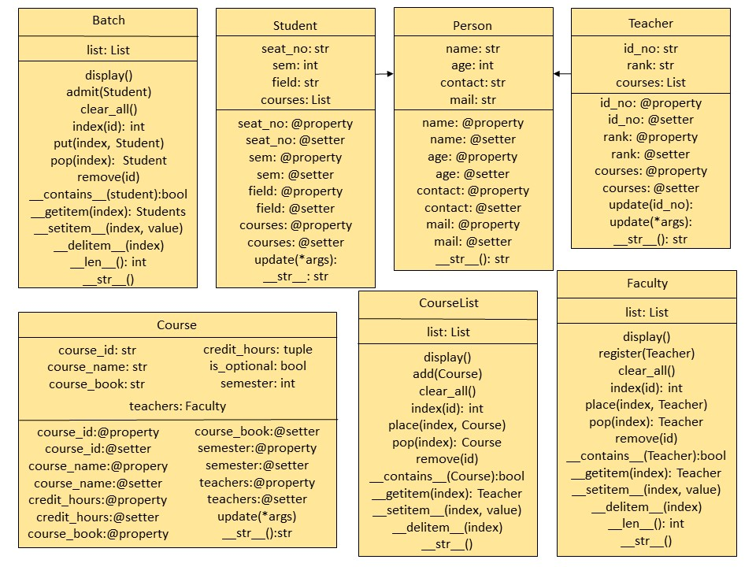

# Mini - Learning Management System

## CS-352 OOP UBIT UoK


### UML



### Project Structure
```
Mini-LMS
│   main.py
│   README.md
│   UML.jpg
│   UML.pptx
│
└───lms
        Course.py
        Person.py
        __init__.py

```