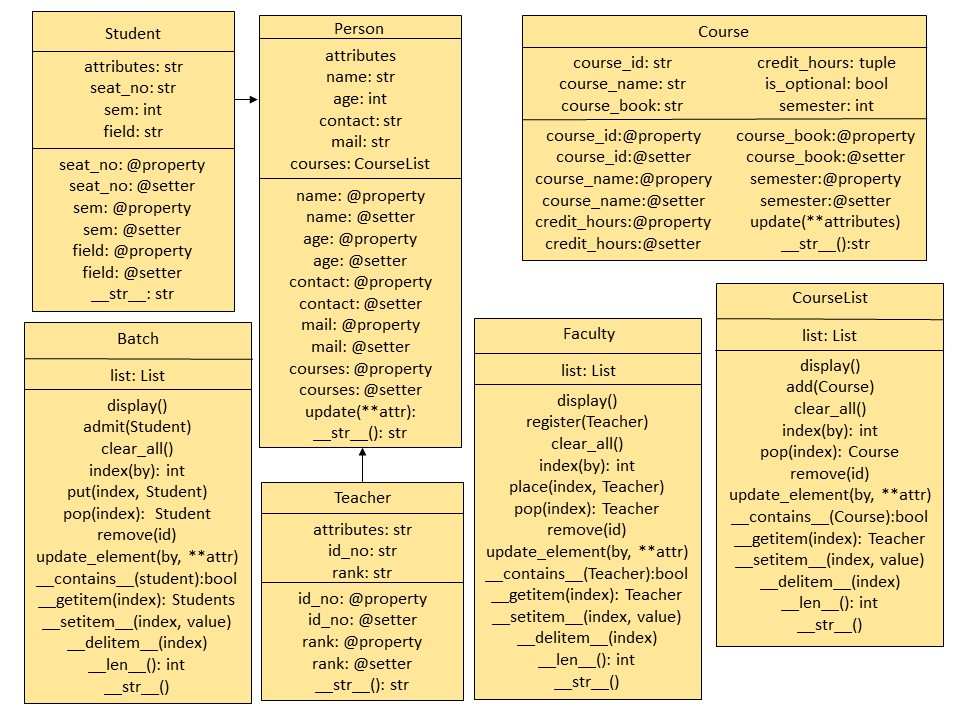

# Mini - Learning Management System

## CS-352 OOP UBIT UoK

Q. Create a Mini - LMS and Follow this Story in Main

1. Create Empty Student List
2. Add Students Ahmed, Aisha and Bilal
3. New Student joins mid semester
4. Search Student
    1. By Seat Number 
    2. By Name
5. Student updates its Info
6. Student leaves the Departement
7. Check the Status of Department


### UML



### Project Structure
```
Mini-LMS
│   main.py
│   README.md
│   UML.jpg
│
└───lms
        Course.py
        Person.py
        __init__.py
```