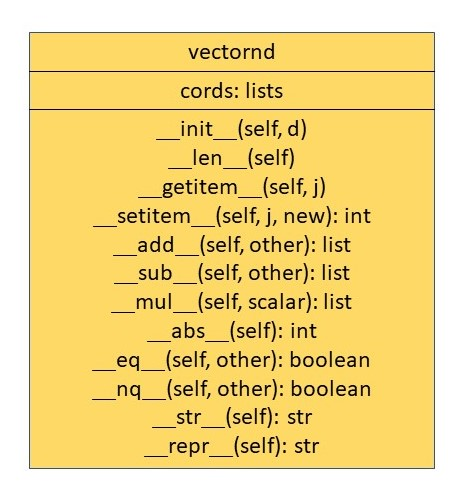

## Turtle
### CS-352 Lab Task

#### Functionality
This project simulates a turtle graphics system where a turtle moves on a canvas with a pen, drawing shapes and patterns (like squares and zigzags) based on given commands.

#### Contains Classes
1. Point  
2. Line  
3. Pen  
4. tkPanel
5. Turtle
6. App
7. Command
9. zigzagCommand
10. squareCommand

#### UML

